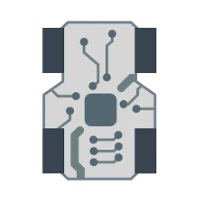

# Android

<!-- Improved compatibility of back to top link -->
<a id="readme-top"></a>

<!-- PROJECT SHIELDS -->
[![Contributors][contributors-shield]][contributors-url]
[![Forks][forks-shield]][forks-url]
[![Stargazers][stars-shield]][stars-url]
[![Issues][issues-shield]][issues-url]
[![Unlicense License][license-shield]][license-url]

<!-- PROJECT LOGO -->
<br />
<div align="center">
  <a href="https://github.com/your_username/Android">
    
  </a>

<h3 align="center">ESP Folkrace Control System</h3>

  <p align="center">
    Real-time PID control, BLE tuning, and wireless telemetry for ESP-based Folkrace robots.
    <br />
    <a href="https://github.com/Linards888/Android"><strong>Explore the docs »</strong></a>
    <br /><br />
    <a href="https://github.com/Linards888/Android/images/Demo">View Demo</a>
    ·
    <a href="https://github.com/Linards888/Android/issues">Report Bug</a>
    ·
    <a href="https://github.com/Linards888/Android/issues">Request Feature</a>
  </p>
</div>

---

<!-- TABLE OF CONTENTS -->
<details>
  <summary>Table of Contents</summary>
  <ol>
    <li>
      <a href="#about-the-project">About The Project</a>
      <ul>
        <li><a href="#key-features">Key Features</a></li>
        <li><a href="#built-with">Built With</a></li>
      </ul>
    </li>
    <li>
      <a href="#getting-started">Getting Started</a>
      <ul>
        <li><a href="#prerequisites">Prerequisites</a></li>
        <li><a href="#installation">Installation</a></li>
      </ul>
    </li>
    <li><a href="#usage">Usage</a></li>
    <li><a href="#system-overview">System Overview</a></li>
    <li><a href="#roadmap">Roadmap</a></li>
    <li><a href="#contributing">Contributing</a></li>
    <li><a href="#license">License</a></li>
    <li><a href="#contact">Contact</a></li>
  </ol>
</details>

---

<!-- ABOUT THE PROJECT -->
## About The Project

[![Product Screenshot][product-screenshot]](images/RobotFolk.png)

This project is a complete control and telemetry system for ESP-based Folkrace robots. It combines real-time PID control, wireless communication, and live BLE tuning into one cohesive setup — so instead of reflashing firmware 50 times to tweak a gain value, you just dial it in from your phone and watch the robot either nail the corner or redecorate the wall (but now scientifically 📈).

The system uses two ESPs: one on the robot running the control logic, and one connected to your PC acting as a telemetry receiver — giving you real-time data logging, plotting, and analysis without any wires trailing behind your robot.


---

### Key Features

- **PID Control System**  
  Stable, tunable control loop for motor management and line/wall following.

- **Live BLE Tuning**  
  Adjust Kp, Ki, and Kd in real time over Bluetooth Low Energy using your phone or PC — no reflashing needed.

- **Wireless Telemetry (Robot ESP → Receiver ESP32)**  
  Streams sensor data, PID state, and runtime info over radio (ESP-32 or similar) to a stationary receiver.

- **PC Logging & Plotting**  
  The receiver ESP32 forwards all telemetry to your PC via Serial — store it, plot it, analyze it with whatever tool you prefer.

- **Broad ESP Compatibility**  
  Designed for ESP32. Adaptable to other ESP boards with minor changes.


---

### Built With

* [ESP32](https://www.espressif.com/en/products/socs/esp32) / ESP platform
* [Arduino Framework](https://www.arduino.cc/)
* Bluetooth Low Energy (BLE)
* [ESP-32](https://www.espressif.com/en/products/software/esp-now/overview) wireless communication
* [HC-12](https://www.hc01.com/downloads/HC-12%20english%20datasheets.pdf) wireless communication
* Serial interface for PC data forwarding


---

<!-- GETTING STARTED -->
## Getting Started

Get your robot running and slightly less chaotic.

### Prerequisites

* [Arduino IDE](https://www.arduino.cc/en/software) or [PlatformIO](https://platformio.org/)
* ESP32 board support installed ([guide here](https://docs.espressif.com/projects/arduino-esp32/en/latest/installing.html))
* Two ESP32 boards — one for the robot, one for the receiver
* A phone or PC with a BLE app (e.g. [nRF Connect](https://www.nordicsemi.com/Products/Development-tools/nrf-connect-for-mobile)) for live PID tuning
* Basic understanding of wiring (if not, good luck soldier 🫡)


<!-- USAGE -->
## Usage

### BLE PID Tuning

1. Power on the robot
2. Open a BLE app on your phone or PC and connect to `Android`
3. Write new Kp, Ki, Kd values to the corresponding BLE characteristics
4. Changes apply in real time — no restart or reupload required

### Telemetry & Logging

1. Connect the receiver ESP32 to your PC via USB
2. Open a Serial monitor or logging script (e.g. Python with `pyserial`)
3. Run the robot — all sensor and PID data streams live to your PC
4. Plot and analyze with your tool of choice (Serial Plotter, matplotlib, etc.)


---

<!-- SYSTEM OVERVIEW -->
## System Overview

```
    ┌─────────────────────────────────┐             ┌─────────────────────────┐
    │         Robot ESP32             │             │     Receiver ESP32      │
    │                                 │             │                         │
    │                 ┌──────────┐    │             │  ┌───────────────────┐  │
    │                 │  Motors  │    │             │  │        PC         │  │
    │                 └─────┬────┘    │             │  └───────────────────┘  │
    │                       ↓         │             │           ↑             │
    │  ┌──────────┐  ┌─────────────┐  │             │  ┌───────────────────┐  │
    │  │  Sensors │→ │ PID Control │  │             │  │      Serial       │  │
    │  └──────────┘  └──────┬──────┘  │             │  └───────────────────┘  │
    │                       ↓         │             │           ↑             │
    │               ┌───────────────┐ │             │  ┌───────────────────┐  │
    │               │  ESP-32 TX    │─┼───────────→─┼─ │    ESP-32 RX      │  │
    │               └───────────────┘ │             │  └───────────────────┘  │
    │                                 │             └─────────────────────────┘
    │  ┌─────────────────────────┐    │                          ↓
    │  │  BLE Server (tuning)    │←───┼── Phone / PC         [ PC Logging,
    │  │  Kp, Ki, Kd             │    │                         Plotting,
    │  └─────────────────────────┘    │                         Analysis ]
    └─────────────────────────────────┘
```


---

<!-- ROADMAP -->
## Roadmap

- [ ] Sensors Reading
- [ ] BLE live tuning
- [ ] ESP-32 telemetry to receiver
- [ ] PC serial data forwarding
- [ ] Dashboard for real-time plotting
- [ ] BLE functions
- [ ] OTA firmware updates

See the [open issues](https://github.com/Linards888/Android/issues) for the full list of proposed features and known bugs.


---

<!-- CONTRIBUTING -->
## Contributing

Contributions are what make the open source community such a great place to learn, build, and break things responsibly. Any contributions you make are **greatly appreciated**.

1. Fork the Project
2. Create your Feature Branch (`git checkout -b feature/AmazingFeature`)
3. Commit your Changes (`git commit -m 'Add some AmazingFeature'`)
4. Push to the Branch (`git push origin feature/AmazingFeature`)
5. Open a Pull Request

---

<!-- CONTACT -->
## Contact

Linards Balodis — [@Linards888](https://www.instagram.com/Linards888) — LinardsBalodis2009@gmail.com

Portfolio — [@Linards888](https://www.linardsb.xyz/)

Project Link: [https://github.com/Linards888/Android](https://github.com/Linards888/Android)

<p align="right">(<a href="#readme-top">back to top</a>)</p>

---

<!-- MARKDOWN LINKS & IMAGES -->
[contributors-shield]: https://img.shields.io/github/contributors/your_username/Android.svg?style=for-the-badge
[contributors-url]: https://github.com/your_username/Android/graphs/contributors
[forks-shield]: https://img.shields.io/github/forks/your_username/Android.svg?style=for-the-badge
[forks-url]: https://github.com/your_username/Android/network/members
[stars-shield]: https://img.shields.io/github/stars/your_username/Android.svg?style=for-the-badge
[stars-url]: https://github.com/your_username/Android/stargazers
[issues-shield]: https://img.shields.io/github/issues/your_username/Android.svg?style=for-the-badge
[issues-url]: https://github.com/your_username/Android/issues
[license-shield]: https://img.shields.io/github/license/your_username/Android.svg?style=for-the-badge
[license-url]: https://github.com/your_username/Android/blob/master/LICENSE
[product-screenshot]: images/screenshot.png
