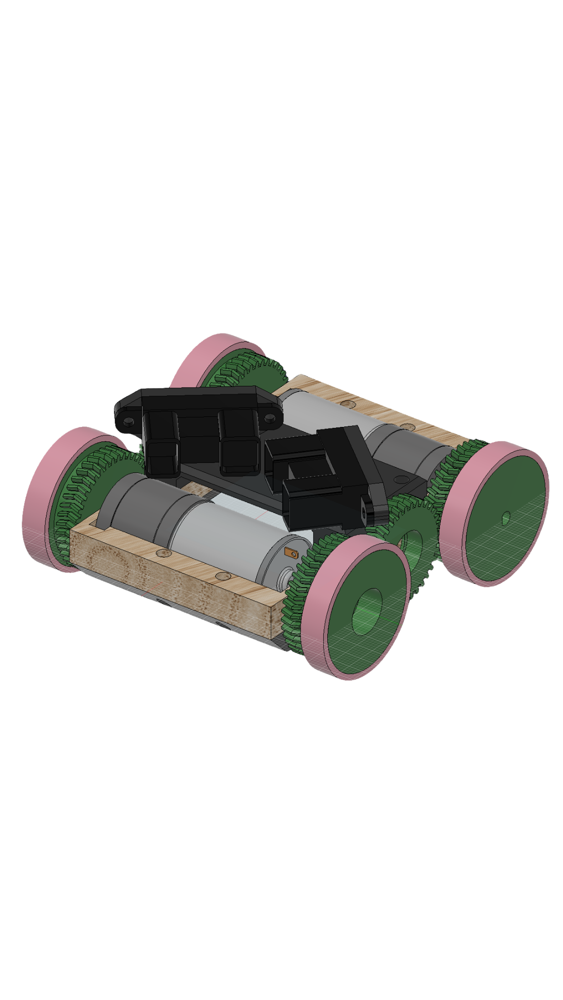

<div align="center">
<pre>
   ░███                      ░██                     ░██       ░██ 
  ░██░██                     ░██                               ░██ 
 ░██  ░██  ░████████   ░████████ ░██░████  ░███████  ░██ ░████████ 
░█████████ ░██    ░██ ░██    ░██ ░███     ░██    ░██ ░██░██    ░██ 
░██    ░██ ░██    ░██ ░██    ░██ ░██      ░██    ░██ ░██░██    ░██ 
░██    ░██ ░██    ░██ ░██   ░███ ░██      ░██    ░██ ░██░██   ░███ 
░██    ░██ ░██    ░██  ░█████░██ ░██       ░███████  ░██ ░█████░██ 
</pre>
</div>

<!-- Improved compatibility of back to top link -->
<a id="readme-top"></a>

<!-- PROJECT SHIELDS -->
[![Contributors][contributors-shield]][contributors-url]
[![Forks][forks-shield]][forks-url]
[![Stargazers][stars-shield]][stars-url]
[![Issues][issues-shield]][issues-url]
[![Unlicense License][license-shield]][license-url]

<!-- PROJECT LOGO -->
<br />
<div align="center">
  <a href="https://github.com/Linards888/Android">
    
  </a>

<h3 align="center">ESP Folkrace Control System</h3>

  <p align="center">
    Real-time PID control, BLE tuning, and wireless telemetry for ESP-based Folkrace robots.
    <br />
    <a href="https://github.com/Linards888/Android"><strong>Explore the docs »</strong></a>
    <br /><br />
    <a href="https://github.com/Linards888/Android/images/Demo">View Demo</a>
    ·
    <a href="https://github.com/Linards888/Android/issues">Report Bug</a>
    ·
    <a href="https://github.com/Linards888/Android/issues">Request Feature</a>
  </p>
</div>

---

<!-- TABLE OF CONTENTS -->
<details>
  <summary>Table of Contents</summary>
  <ol>
    <li>
      <a href="#about-the-project">About The Project</a>
      <ul>
        <li><a href="#key-features">Key Features</a></li>
        <li><a href="#built-with">Built With</a></li>
      </ul>
    </li>
    <li>
      <a href="#getting-started">Getting Started</a>
      <ul>
        <li><a href="#prerequisites">Prerequisites</a></li>
        <li><a href="#installation">Installation</a></li>
      </ul>
    </li>
    <li><a href="#usage">Usage</a></li>
    <li><a href="#system-overview">System Overview</a></li>
    <li><a href="#roadmap">Roadmap</a></li>
    <li><a href="#contributing">Contributing</a></li>
    <li><a href="#license">License</a></li>
    <li><a href="#contact">Contact</a></li>
  </ol>
</details>

---

<!-- ABOUT THE PROJECT -->
## About The Project

<div align="center">
  <a href="https://github.com/Linards888/Android">
    
  </a>

This project is a complete control and telemetry system for ESP-based Folkrace robots. It combines real-time PID control, wireless communication, and live BLE tuning into one cohesive setup — so instead of reflashing firmware 50 times to tweak a gain value, you just dial it in from your phone and watch the robot either nail the corner or redecorate the wall (but now scientifically 📈).

The system uses two ESPs: one on the robot running the control logic, and one connected to your PC acting as a telemetry receiver — giving you real-time data logging, plotting, and analysis without any wires trailing behind your robot.


---

### Key Features

- **PID Control System**  
  Stable, tunable control loop for motor management and line/wall following.

- **Live BLE Tuning**  
  Adjust Kp, Ki, and Kd in real time over Bluetooth Low Energy using your phone or PC — no reflashing needed.

- **Wireless Telemetry with PC Logging & Plotting**  
  Streams sensor data, PID state, and runtime info over radio (ESP-32 or similar) to a stationary receiver.

- **Folkrace positioning on the track**  
  A setting that when enabled can understand its position in track and how the track looks like.

---

### Built With

* [ESP32](https://www.espressif.com/en/products/socs/esp32) / ESP platform
* [Arduino Framework](https://www.arduino.cc/)
* [ESP-32](https://www.espressif.com/en/products/software/esp-now/overview) wireless communication
* Bluetooth Low Energy (BLE)
* Serial and GUI interface for PC data forwarding


---

<!-- GETTING STARTED -->
<!--
## Getting Started

Instructions

-->

---

<!-- SYSTEM OVERVIEW -->
## System Overview NOT EXACT (made by AI)

```
    ┌──────────────────────────────────┐          ┌─────────────────┐   ┌────────────────────────────────────────┐
    │■■■■■■■■■ Folkrace ESP32 ■■■■■■■■■│          │■■■■■ Phone ■■■■■│   │■■■■■■■■■■■■■■■■■■ PC ■■■■■■■■■■■■■■■■■■│
    │                                  │          │╔═══════════════╗│   │ ╔══════════════╗   ╔═════════════════╗ │
    │   ╔══════════╗   ╔═══════════╗   │          │║ bluetooth app ║│   │ ║   Logging,   ║   ║  Data logger    ║ │
    │   ║  Motors  ║   ║  Sensors  ║   │    ╔══════╣      or       ║│   │ ║   Plotting,  ║   ║                 ║ │
    │   ╚════╦═════╝   ╚═════╦═════╝   │    ║     │║   BT serial   ║│   │ ║   Analysis,  ╠═══╣ CSV file format ║ │
    │        ╚═══════╦═══════╝         │    ║     │╚═══════════════╝│   │ ║    Mapping   ║   ║                 ║ │
    │     ╔══════════════════════╗     │    ║     └─────────────────┘   │ ╚══════════════╝   ╚═══════╦═════════╝ │
    │     ║  PID Control & Magic ╠══════════╬═ bluetooth                └────────────────────────────║───────────┘
    │     ╚══════════════════════╝     │    ║   ┌───────────────────────────────────────┐            ║            
    │        ╔═══════╩═══════╗         │    ║   │■■■■■■■■■■■ Ground Station ■■■■■■■■■■■■│            ║            
    │  ╔═════╩═════╗   ╔═════╩═════╗   │    ║   │ ╔═══════════════╗   ╔═══════════════╗ │            ║            
    │  ║  Battery  ║   ║    etc.   ║   │    ║   │ ║  BLE receiver ║   ║     Serial    ║ │            ║            
    │  ╚═══════════╝   ╚═══════════╝   │    ╚═════╣               ║   ║               ╠══════════════╝            
    │                                  │        │ ║   Gets Data   ╠═══╣  sends to PC  ║ │                         
    │                                  │        │ ╚═══════════════╝   ╚═══════════════╝ │                         
    └──────────────────────────────────┘        └───────────────────────────────────────┘                         
```


---

<!-- ROADMAP -->
## Roadmap

- [x] configuration.h and logic
- [x] tof logic
- [x] BLE logic BUT I WILL REDO
- [ ] Working demo(hopefully), so its more visual, not just code.
- [ ] Memory logic
- [x] Drive system
- [ ] Folkrace states
- [ ] PID logic & Matematics/Calculations
- [ ] Calibrations
- [ ] Prob something else
- [ ] Ground station
- [ ] OTA firmware updates

See the [open issues](https://github.com/Linards888/Android/issues) for the full list of proposed features and known bugs.

---

<!-- CONTRIBUTING -->
## Contributing

Contributions are what make the open source community such a great place to learn, build, and break things responsibly. Any contributions you make are **greatly appreciated**.

1. Fork the Project
2. Create your Feature Branch (`git checkout -b feature/AmazingFeature`)
3. Commit your Changes (`git commit -m 'Add some AmazingFeature'`)
4. Push to the Branch (`git push origin feature/AmazingFeature`)
5. Open a Pull Request

---

<!-- CONTACT -->
## Contact

Linards Balodis — [@Linards888](https://www.instagram.com/Linards888) — LinardsBalodis2009@gmail.com

Portfolio — [@Linards888](https://www.linardsb.xyz/)

Project Link: [https://github.com/Linards888/Android](https://github.com/Linards888/Android)

<p align="right">(<a href="#readme-top">back to top</a>)</p>

---

<!-- MARKDOWN LINKS & IMAGES -->
[contributors-shield]: https://img.shields.io/github/contributors/Linards888/Android.svg?style=for-the-badge
[contributors-url]: https://github.com/Linards888/Android/graphs/contributors
[forks-shield]: https://img.shields.io/github/forks/Linards888/Android.svg?style=for-the-badge
[forks-url]: https://github.com/Linards888/Android/network/members
[stars-shield]: https://img.shields.io/github/stars/Linards888/Android.svg?style=for-the-badge
[stars-url]: https://github.com/Linards888/Android/stargazers
[issues-shield]: https://img.shields.io/github/issues/Linards888/Android.svg?style=for-the-badge
[issues-url]: https://github.com/Linards888/Android/issues
[license-shield]: https://img.shields.io/github/license/Linards888/Android.svg?style=for-the-badge
[license-url]: https://github.com/Linards888/Android/blob/master/LICENSE
[product-screenshot]: images/screenshot.png