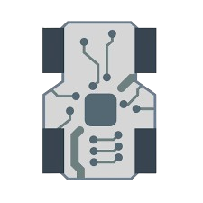
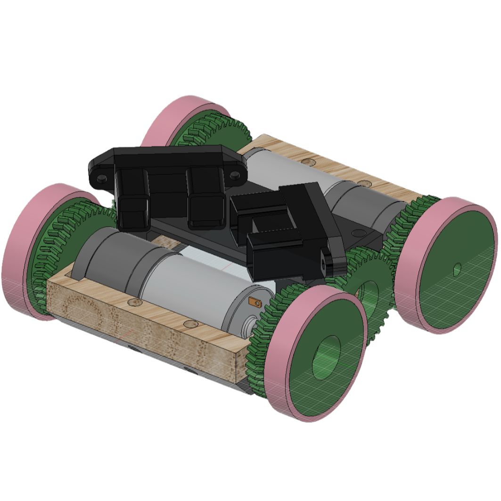

<div align="center">
<pre>
   ░███                      ░██                     ░██       ░██ 
  ░██░██                     ░██                               ░██ 
 ░██  ░██  ░████████   ░████████ ░██░████  ░███████  ░██ ░████████ 
░█████████ ░██    ░██ ░██    ░██ ░███     ░██    ░██ ░██░██    ░██ 
░██    ░██ ░██    ░██ ░██    ░██ ░██      ░██    ░██ ░██░██    ░██ 
░██    ░██ ░██    ░██ ░██   ░███ ░██      ░██    ░██ ░██░██   ░███ 
░██    ░██ ░██    ░██  ░█████░██ ░██       ░███████  ░██ ░█████░██ 
</pre>
</div>

<!-- Improved compatibility of back to top link -->
<a id="readme-top"></a>

<!-- PROJECT SHIELDS -->
[![Contributors][contributors-shield]][contributors-url]
[![Forks][forks-shield]][forks-url]
[![Stargazers][stars-shield]][stars-url]
[![Issues][issues-shield]][issues-url]
[![Unlicense License][license-shield]][license-url]

<!-- PROJECT LOGO -->
<br />
<div align="center">
  <a href="https://github.com/Linards888/Android">
    
  </a>

<h3 align="center">ESP Folkrace Control System</h3>

  <p align="center">
    Real-time PID control, BLE tuning, and wireless telemetry for ESP-based Folkrace robots — one codebase, any number of robots.
    <br />
    <a href="docs/Arhitecture.md"><strong>Explore the docs »</strong></a>
    <br /><br />
    <a href="https://github.com/Linards888/Android/images/Demo">View Demo</a>
    ·
    <a href="https://github.com/Linards888/Android/issues">Report Bug</a>
    ·
    <a href="https://github.com/Linards888/Android/issues">Request Feature</a>
  </p>
</div>

---

<!-- TABLE OF CONTENTS -->
<details>
  <summary>Table of Contents</summary>
  <ol>
    <li>
      <a href="#about-the-project">About The Project</a>
      <ul>
        <li><a href="#key-features">Key Features</a></li>
        <li><a href="#built-with">Built With</a></li>
      </ul>
    </li>
    <li>
      <a href="#getting-started">Getting Started</a>
    </li>
    <li><a href="#usage">Usage</a></li>
    <li><a href="#system-overview">System Overview</a></li>
    <li><a href="#roadmap">Roadmap</a></li>
    <li><a href="#contributing">Contributing</a></li>
    <li><a href="#license">License</a></li>
    <li><a href="#contact">Contact</a></li>
  </ol>
</details>

---

<!-- ABOUT THE PROJECT -->
## About The Project

<div align="center">
  <a href="https://github.com/Linards888/Android">
    
  </a>

This project is a complete control system for ESP-based Folkrace robots. It combines real-time PID control, live BLE tuning, and a hardware abstraction layer into one cohesive setup — so instead of reflashing firmware 50 times to tweak a gain value, or maintaining a separate copy of the whole project per robot you own, you dial values in from your phone and swap robots by changing one config file.

</div>

---

### Key Features

- **PID Control System**  
  Stable, tunable control loop for motor management and line/wall following.

- **Live BLE Tuning**  
  `get`/`set`/`list`/`toggle` *any* registered parameter in real time over Bluetooth Low Energy — no reflashing needed. Adding a new tunable is one line of code (`REGISTER_PARAM(...)`) and it's automatically BLE-exposed, listed, and flash-saved.

- **One codebase, many robots**  
  Pins, sensors, motor/steering layout and optional features all live in a small `configs/config_<robot>.h` file per physical robot — switch or add robots by changing one line in `config.h`, never by copying the project. See `configs/config_template.h`.

- **Sensor- and motor-agnostic logic**  
  `Android.ino` reads sensors with `dist("name")` and drives with `drive_set(speed, steer)` regardless of whether that's a Sharp IR or a VL53L0X underneath, or a 1/2/4-motor, brushed/brushless, differential- or servo-steered chassis. Swap hardware without touching the control logic.

- **Serial Telemetry for PC Logging & Plotting**  
  Streams sensor/PID/state data as CSV over Serial for any PC script or plotter to consume.

- **Folkrace positioning on the track**  
  A setting that when enabled can understand its position in track and how the track looks like. **Scaffolded, not implemented yet** — see `src/spaceAverenes/space.h`.

---

### Built With

* [ESP32](https://www.espressif.com/en/products/socs/esp32) / ESP platform
* [Arduino Framework](https://www.arduino.cc/)
* Bluetooth Low Energy (BLE)
* Serial interface for PC data logging

---

<!-- GETTING STARTED -->
## Getting Started

See [`docs/Necessities.md`](docs/Necessities.md) for exactly what hardware/software/libraries you need, then [`docs/Setup.md`](docs/Setup.md) for step-by-step install, configuration, and upload instructions. [`docs/Arhitecture.md`](docs/Arhitecture.md) explains how the codebase is put together and has a task-oriented "How do I...?" section for common changes (add a sensor, add a command, add a tunable parameter, build for a new robot).

---

<!-- SYSTEM OVERVIEW -->
## System Overview

```
┌──────────────────────────────────┐    ┌─────────────────┐ ┌───────────────────────────────────────┐
│■■■■■■■■■ Folkrace ESP32 ■■■■■■■■■│    │■■■■■ Phone ■■■■■│ │■■■■■■■■■■■■■■■■■■ PC ■■■■■■■■■■■■■■■■■│
│                                  │    │╔═══════════════╗│ │ ╔══════════════╗  ╔═════════════════╗ │
│   ╔══════════╗   ╔═══════════╗   │    │║ bluetooth app ║│ │ ║   Logging,   ║  ║  Data logger    ║ │
│   ║  Motors  ║   ║  Sensors  ║   │ ╔═══╣      or       ║│ │ ║   Plotting,  ║  ║                 ║ │
│   ╚════╦═════╝   ╚═════╦═════╝   │ ║  │║   BT serial   ║│ │ ║   Analysis,  ╠══╣ CSV file format ║ │
│        ╚═══════╦═══════╝         │ ║  │╚═══════════════╝│ │ ║    Mapping   ║  ║                 ║ │
│     ╔══════════════════════╗     │ ║  └─────────────────┘ │ ╚══════════════╝  ╚════════╦════════╝ │
│     ║  PID Control & Magic ╠═══════╬════bluetooth         └────────────────────────────║──────────┘
│     ╚══════════════════════╝     │ ║  ┌───────────────────────────────────────┐        ║           
│        ╔═══════╩═══════╗         │ ║  │■■■■■■■■■■■ Ground Station ■■■■■■■■■■■■│        ║           
│  ╔═════╩═════╗   ╔═════╩═════╗   │ ║  │ ╔═══════════════╗   ╔═══════════════╗ │        ║           
│  ║  Battery  ║   ║    etc.   ║   │ ║  │ ║  BLE receiver ║   ║     Serial    ║ │        ║           
│  ╚═══════════╝   ╚═══════════╝   │ ╚════╣               ║   ║               ╠══════════╝           
│                                  │    │ ║   Gets Data   ╠═══╣  sends to PC  ║ │                    
│                                  │    │ ╚═══════════════╝   ╚═══════════════╝ │                    
└──────────────────────────────────┘    └───────────────────────────────────────┘                    
```

Today's firmware implements the left-hand box (the robot itself, over BLE to
a phone) plus plain Serial CSV telemetry. The dedicated ESP-NOW "ground
station" receiver on the right is not built yet — see the Roadmap.

---

<!-- ROADMAP -->
## Roadmap

- [x] config.h / configs/ per-robot configuration system
- [x] ToF (VL53L0X), Sharp IR, and ultrasonic sensor logic behind one `dist()` API
- [x] BLE logic — rebuilt: generic parameter registry (`get`/`set`/`list`/`toggle`) instead of one command per value
- [x] Memory logic (flash save/restore of every tunable)
- [x] Drive system — 1/2/4 motor, brushed/brushless, differential/servo steering
- [x] Folkrace states (IDLE/READY/CALIBRATING/COUNTDOWN/RUNNING + manual test-drive states)
- [x] PID logic & math
- [x] Calibrations (live sensor dump + IMU bias calibration)
- [ ] Working demo (hopefully), so its more visual, not just code.
- [ ] Space Awareness — scaffolded only, see `src/spaceAverenes/space.h`
- [ ] Prob something else
- [ ] Ground station (dedicated ESP-NOW/radio receiver + PC app)
- [ ] OTA firmware updates

See the [open issues](https://github.com/Linards888/Android/issues) for the full list of proposed features and known bugs.

---

<!-- CONTRIBUTING -->
## Contributing

Contributions are what make the open source community such a great place to learn, build, and break things responsibly. Any contributions you make are **greatly appreciated**.

1. Fork the Project
2. Create your Feature Branch (`git checkout -b feature/AmazingFeature`)
3. Commit your Changes (`git commit -m 'Add some AmazingFeature'`)
4. Push to the Branch (`git push origin feature/AmazingFeature`)
5. Open a Pull Request

---

<!-- CONTACT -->
## Contact

Linards Balodis — [@Linards888](https://www.instagram.com/Linards888) — LinardsBalodis2009@gmail.com

Portfolio — [@Linards888](https://www.linardsb.xyz/)

Project Link: [https://github.com/Linards888/Android](https://github.com/Linards888/Android)

<p align="right">(<a href="#readme-top">back to top</a>)</p>

---

<!-- MARKDOWN LINKS & IMAGES -->
[contributors-shield]: https://img.shields.io/github/contributors/Linards888/Android.svg?style=for-the-badge
[contributors-url]: https://github.com/Linards888/Android/graphs/contributors
[forks-shield]: https://img.shields.io/github/forks/Linards888/Android.svg?style=for-the-badge
[forks-url]: https://github.com/Linards888/Android/network/members
[stars-shield]: https://img.shields.io/github/stars/Linards888/Android.svg?style=for-the-badge
[stars-url]: https://github.com/Linards888/Android/stargazers
[issues-shield]: https://img.shields.io/github/issues/Linards888/Android.svg?style=for-the-badge
[issues-url]: https://github.com/Linards888/Android/issues
[license-shield]: https://img.shields.io/github/license/Linards888/Android.svg?style=for-the-badge
[license-url]: https://github.com/Linards888/Android/blob/master/LICENSE
[product-screenshot]: images/screenshot.png
